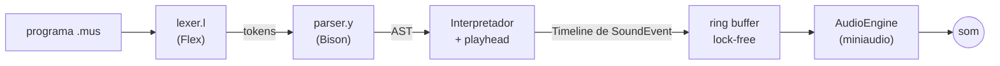

# Visão do Produto e Arquitetura

O Interpretador Musical (Grupo 03) é, na prática, um **compilador musical** para uma *Domain-Specific Language* (DSL). A arquitetura se apoia numa separação estrita de responsabilidades: de um lado, o núcleo do compilador (a lógica da linguagem); do outro, o motor de áudio (a geração do sinal sonoro).

## 1. O compilador (pré-processamento)

O núcleo do compilador, escrito em C++17 com Flex e Bison, não emite som nem executa instruções em tempo real. O processamento é em lote (*batch*):

1. **Leitura:** o compilador recebe o código-fonte inteiro (arquivo `.mus`).
2. **Análise léxica** (`lexer/lexer.l`): o Flex quebra o texto em tokens — comandos, notas, números, operadores —, registrando a linha e a coluna de cada um. A flag `--tokens` imprime essa tabela.
3. **Análise sintática** (`parser/parser.y`): o Bison valida a gramática e monta a **Árvore Sintática Abstrata** (AST, em `src/interpreter/ast.h`). Um erro léxico ou sintático interrompe a compilação com a posição exata, antes de qualquer som.
4. **Geração de eventos** (`src/interpreter/`): o interpretador percorre a AST e, com o **playhead**, produz uma **lista estática de eventos musicais temporizados** na memória, a `Timeline`.

Cada nota tocada vira um `SoundEvent` com:

* **`startTime`**: o instante, em segundos, em que o som começa;
* **`duration`**: por quanto tempo a nota soa;
* **`frequency`**: a altura da nota, em Hz;
* **`volume`**: a intensidade do som, de 0.0 a 1.0.

## 2. O motor de áudio (execução)

Só depois da compilação completa, sem nenhum erro, a lista de eventos é entregue ao motor de áudio. Os eventos são ordenados pelo instante de início e colocados num *ring buffer* SPSC (um produtor, um consumidor) sem trava, de onde o callback de áudio da **miniaudio** os consome e sintetiza as frequências, amostra por amostra.

A *miniaudio* é quem conversa com a interface de áudio do sistema operacional (ALSA/PulseAudio no Linux e WSL, CoreAudio no macOS). Com isso, o núcleo do compilador cuida só da estrutura da linguagem e deixa a complexidade do processamento de sinal para o motor de áudio — e pode ser testado sem placa de som, com a flag `--no-audio`.

## 3. Modelo da linguagem: programa finito

Em 16/09 o grupo fixou o modelo da linguagem: um programa é uma **música com começo e fim** (como na linguagem Alda). O interpretador percorre a AST uma única vez, monta a timeline inteira e a entrega pronta ao áudio.

O modelo descartado foi o do TidalCycles, em que um padrão é uma função infinita do tempo, consultada em pequenas janelas enquanto a música já toca, com *live coding* por cima. Parte das issues do [cronograma]({{ site.baseurl }}) ainda descreve esse modelo; elas deixaram de ser o caminho crítico do projeto.

## 4. Organização do código

| Pasta | Responsabilidade |
|---|---|
| `lexer/`, `parser/` | Especificações Flex e Bison |
| `src/frontend/` | Invólucro C++ do lexer e do parser (`tokenize`, `parseToAst`) |
| `src/interpreter/` | AST e interpretador *tree-walking* |
| `src/core/` | `SoundEvent`, `Timeline`, playhead, conversão de altura e ring buffer |
| `src/audio/` | Motor de áudio sobre a miniaudio e carregamento de WAV |
| `src/cli/` | Opções de linha de comando e logger |
| `tests/` | Suíte doctest, executada pelo CTest e pelo CI |

O lexer e o parser formam uma biblioteca própria (`mus_lexer`), separada da biblioteca do núcleo (`mus_core`). Isso permite testar cada parte sem o executável e sem depender de Flex e Bison onde eles não são necessários.
