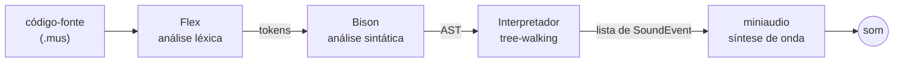

# Interpretador Musical
{: .fs-9 .mb-2 }

Uma linguagem de programação que vira música.
{: .fs-6 .fw-300 .text-grey-dk-000 }

[Documentação]({{ site.baseurl }}){: .btn .btn-primary .mr-2 }
[Roadmap]({{ site.baseurl }}){: .btn }

---

## O que é

Este projeto é um **interpretador que traduz uma linguagem de programação própria em
som**. Em vez de imprimir texto na tela, um programa escrito nessa linguagem produz
música — o conceito é próximo ao de ferramentas como o Sonic Pi, mas aqui o
lexer, o parser e o interpretador são inteiramente autorais.

É o trabalho do Grupo 03 na disciplina de **Compiladores 1** (Turma 01, Prof. Sérgio),
na FCTE/UnB.

## Por que não é só um tradutor de notas

Ao aprovar a ideia, o professor colocou uma condição: a linguagem precisa ter
complexidade real para valer como trabalho de Compiladores. Não basta um tradutor
linear do tipo "nota X toca por tempo Y".

Por isso a linguagem precisa suportar:

- variáveis (tempo, tom, andamento);
- estruturas de repetição;
- condicionais;
- funções com parâmetros;
- expressões aritméticas, para transposição de notas e cálculo de durações;
- comentários de linha e de bloco;
- erros léxicos e sintáticos com indicação de linha e coluna.

## Como funciona



Uma decisão de arquitetura atravessa todo o projeto: **o interpretador não toca som**.
Ele apenas produz uma lista de eventos temporizados —

```cpp
struct SoundEvent {
    float startTime;   // quando começa, em segundos
    float duration;    // quanto dura
    float frequency;   // altura da nota, em Hz
    float volume;      // amplitude
};
```

— que só depois é entregue ao motor de áudio. Isso mantém a lógica de linguagem
(lexer, parser, interpretador) separada da lógica de áudio, e é o que torna o
interpretador testável sem depender de placa de som.

## O playhead

O que diferencia este interpretador de um interpretador comum é o **playhead**: um
cursor de tempo que avança conforme o programa executa. Tocar uma nota não emite som
na hora — agenda um evento na posição atual do cursor e empurra o cursor para frente.

É esse mecanismo que dá sentido musical às estruturas de controle:

| Construção | Efeito musical |
|---|---|
| Sequência de comandos | Notas em sequência, uma após a outra |
| Repetição | O cursor avança a cada volta, transformando laço em **padrão rítmico** |
| Condicional | Variação: caminhos diferentes produzem trechos diferentes |
| Função | Um **motivo reutilizável**; o tempo gasto dentro dela se acumula no cursor externo |

Múltiplas vozes simultâneas exigiriam vários cursores independentes, com fusão das
timelines antes do envio ao áudio. Está registrado como feature avançada e opcional.

## Um exemplo

{: .nota }
> A sintaxe abaixo é a **definida e implementada** no lexer e no parser. O que ainda
> falta decidir é só o **nome da linguagem**, que não aparece em nenhum arquivo de
> código — ver o [roadmap]({{ site.baseurl }}).

```text
andamento 120
tempo = 0.5

repita 4 vezes {
    toca do4  por tempo
    toca mi4  por tempo
    toca sol4 por tempo
}

toca la4 - 2 por tempo * 2   /* transposição e duração calculadas */
pausa por 1.0
```

Quatro repetições de um arpejo: o mesmo trecho de código, executado quatro vezes,
vira quatro compassos — porque o playhead avança a cada nota.

Para ver o analisador léxico trabalhando sobre esse programa:

```bash
./build/compilador --tokens exemplos/arpejo.mus
```

### As decisões de sintaxe

| Assunto | Decisão |
|---|---|
| Idioma | Português, de ponta a ponta |
| Notas | `do re mi fa sol la si`, com `#` para sustenido e `b` para bemol |
| Oitava | Colada na nota: `do4` é o dó central (MIDI 60), `la4` é o lá de 440 Hz |
| Sem oitava | `toca do` usa a oitava corrente, definida por `oitava 4` |
| Duração | Em **tempos**: `1.0` é uma semínima, `0.5` uma colcheia. O BPM converte para segundos |
| Separador | A palavra **`por`** separa altura de duração: `toca do4 por tempo` |
| Comentários | `//` até o fim da linha e `/* */` em bloco |
| Blocos | Delimitados por `{ }` |

O `por` não é enfeite. Sem ele, `toca la4 - 2 por tempo` seria ambíguo — o parser não
teria como saber se `- 2` pertence à altura ou é o começo da duração. Com o separador,
os dois lados aceitam expressão à vontade e a gramática fica sem nenhum conflito.

## Stack

| Camada | Escolha |
|---|---|
| Implementação | C++17 |
| Análise léxica | Flex |
| Análise sintática | Bison |
| Áudio | miniaudio (single-header, sintetiza a forma de onda) |
| Build | CMake |
| Plataforma alvo | Windows |

A engine Godot chegou a ser considerada, mas foi descartada como abordagem principal:
usar GDScript significaria depender do parser e do interpretador prontos da engine,
enfraquecendo exatamente a parte que a disciplina avalia.

## Estado atual

A sintaxe está definida e o **front-end existe**: o `lexer.l` reconhece o vocabulário
completo da linguagem — palavras-chave, notas com acidente e oitava, inteiros e reais
como tipos distintos, identificadores, operadores e comentários — com linha e coluna em
cada token. O `parser.y` reconhece atribuição, os comandos musicais e a repetição com
bloco, sem conflitos.

O que ainda não existe: a árvore sintática, o interpretador que a percorre e a ligação
com o motor de áudio. As decisões tomadas até aqui estão
registradas nas [atas de reunião]({{ site.baseurl }}), e o
que falta está no [roadmap]({{ site.baseurl }}).
