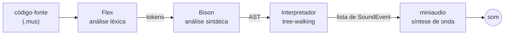

# Compilador Musical
{: .fs-9 .mb-2 }

Uma Domain-Specific Language (DSL) que transforma código em música.
{: .fs-6 .fw-300 .text-grey-dk-000 }

[Documentação]({{ site.baseurl }}){: .btn .btn-primary .mr-2 }
[Roadmap]({{ site.baseurl }}){: .btn }

---

## O que é

Este projeto é um **compilador em lote (*batch*) que traduz uma linguagem de programação própria em som**. Em vez de imprimir texto na tela, um programa escrito nesta linguagem produz música. Todo o pipeline — desde o analisador léxico até o gerador da árvore sintática — é inteiramente autoral.

É o trabalho do Grupo 03 na disciplina de **Compiladores 1** (Turma 01, Prof. Sérgio), na FCTE/UnB.

## Por que não é só um tradutor de notas

Ao aprovar a ideia, o professor colocou uma condição: a linguagem precisa ter complexidade real para valer como trabalho de Compiladores. Não basta um tradutor linear do tipo "nota X toca por tempo Y".

Por isso a linguagem suporta:

- variáveis (tempo, tom, andamento);
- estruturas de repetição;
- condicionais (em desenvolvimento);
- funções com parâmetros (em desenvolvimento);
- expressões aritméticas e lógicas, para transposição de notas e cálculo de durações;
- comentários de linha e de bloco;
- erros léxicos e sintáticos com indicação de linha e coluna.

## Como funciona



Uma decisão de arquitetura atravessa todo o projeto: **o núcleo do compilador não emite som**. Ele apenas produz uma lista estática de eventos temporizados —

```cpp
struct SoundEvent {
    double startTime;  // quando começa, em segundos
    double duration;   // quanto dura, em segundos
    double frequency;  // altura da nota, em Hz
    float  volume;     // amplitude, de 0.0 a 1.0
};
```

— que só depois da compilação completa é entregue ao motor de áudio. Isso mantém a lógica de linguagem separada da lógica de processamento de sinais, tornando o compilador testável sem depender de hardware de som.

## O playhead

O conceito central deste compilador é o **playhead**: um cursor de tempo que avança conforme o interpretador percorre a árvore sintática. Agendar uma nota não bloqueia a execução — apenas insere um evento na posição atual do cursor e o empurra para a frente.

É esse mecanismo que dá sentido musical às estruturas de controle:

| Construção | Efeito musical |
|---|---|
| Sequência de comandos | Notas em sequência, uma após a outra |
| Repetição | O cursor avança a cada volta, transformando laço em **padrão rítmico** |
| Condicional | Variação: caminhos diferentes produzem trechos diferentes |
| Função | Um **motivo reutilizável**; o tempo gasto dentro dela se acumula no cursor externo |

Múltiplas vozes simultâneas exigiriam vários cursores independentes, com fusão das
timelines antes do envio ao áudio. Está registrado como feature avançada e opcional.

## Um exemplo

{: .nota }
> A sintaxe abaixo é a **definida e implementada** no lexer e no parser. O que ainda
> falta decidir é só o **nome da linguagem**, que não aparece em nenhum arquivo de
> código — ver o [roadmap]({{ site.baseurl }}).

```text
andamento 120
tempo = 0.5

repita 4 vezes {
    toca do4  por tempo
    toca mi4  por tempo
    toca sol4 por tempo
}

toca la4 - 2 por tempo * 2   /* transposição e duração calculadas */
pausa por 1.0
```

Quatro repetições de um arpejo: o mesmo trecho de código, executado quatro vezes, transforma-se em quatro compassos sonoros (pois o playhead avança a cada nota processada).

Uma versão comentada deste programa está no repositório, em `exemplos/arpejo.mus`. Para ver o analisador léxico extraindo os tokens dele, com linha e coluna de cada um:

```bash
./build/compilador --tokens exemplos/arpejo.mus
```

E para compilar e tocar:

```bash
./build/compilador exemplos/arpejo.mus             # compila e toca
./build/compilador --no-audio exemplos/arpejo.mus  # compila sem tocar: "14 eventos, 4 s de música"
```

Um erro no programa é apontado com a posição exata, e nada chega ao áudio:

```text
[ERROR] erro de sintaxe: Linha 1, Coluna 1: syntax error
```

### As decisões de sintaxe

| Assunto | Decisão |
|---|---|
| Idioma | Português, de ponta a ponta |
| Notas | `do re mi fa sol la si`, com `#` para sustenido e `b` para bemol |
| Oitava | Colada na nota: `do4` é o dó central (MIDI 60), `la4` é o lá de 440 Hz |
| Sem oitava | `toca do` usa a oitava corrente, definida por `oitava 4` |
| Duração | Em **tempos**: `1.0` é uma semínima, `0.5` uma colcheia. O BPM converte para segundos |
| Separador | A palavra **`por`** separa altura de duração: `toca do4 por tempo` |
| Comentários | `//` até o fim da linha e `/* */` em bloco |
| Blocos | Delimitados por `{ }` |

A palavra-chave `por` é obrigatória. Sem ela, a instrução `toca la4 - 2 tempo` seria ambígua: o parser não teria como saber se `- 2` pertence à altura ou é o começo da duração. Com o separador, os dois lados aceitam expressão à vontade e a gramática fica sem nenhum conflito de shift/reduce.

## Stack

| Camada | Escolha |
|---|---|
| Implementação | C++17 |
| Análise léxica | Flex |
| Análise sintática | Bison |
| Áudio | miniaudio (single-header, sintetiza a forma de onda) |
| Build | CMake |
| Testes | doctest + CTest, rodando no CI (Linux e macOS) a cada PR |
| Plataformas | Windows (via WSL), Linux e macOS |

A engine Godot chegou a ser considerada, mas foi descartada como abordagem principal:
usar GDScript significaria depender do parser e do interpretador prontos da engine,
enfraquecendo exatamente a parte que a disciplina avalia.

## Estado atual

Ao fim da Sprint 2, o compilador opera de ponta a ponta: de um arquivo `.mus` até o som.

- **Front-end:** o `lexer.l` reconhece todo o vocabulário (inclusive `se`, `senao`, `defina` e `retorna`, já reservados) e o `parser.y` monta a Árvore Sintática Abstrata (AST) sem nenhum conflito de gramática.
- **Erros:** erros léxicos e sintáticos são reportados com linha e coluna, e o programa não segue para o áudio.
- **Interpretador:** percorre a AST com o playhead e produz a timeline de `SoundEvent` na memória.
- **Áudio:** a timeline, ordenada, passa por um *ring buffer* sem trava (*lock-free*) até o callback da `miniaudio`, que sintetiza as notas.
- **Testes:** 194 casos de teste cobrindo lexer, parser, AST, interpretador, playhead e motor de áudio, rodando no CI em Linux e macOS, com uma passada extra sob ThreadSanitizer.

O próximo passo é a expansão da linguagem (condicionais e funções) e a formalização da gramática em EBNF. As decisões tomadas até aqui estão
registradas nas [atas de reunião]({{ site.baseurl }}), e o
que falta está no [roadmap]({{ site.baseurl }}).
